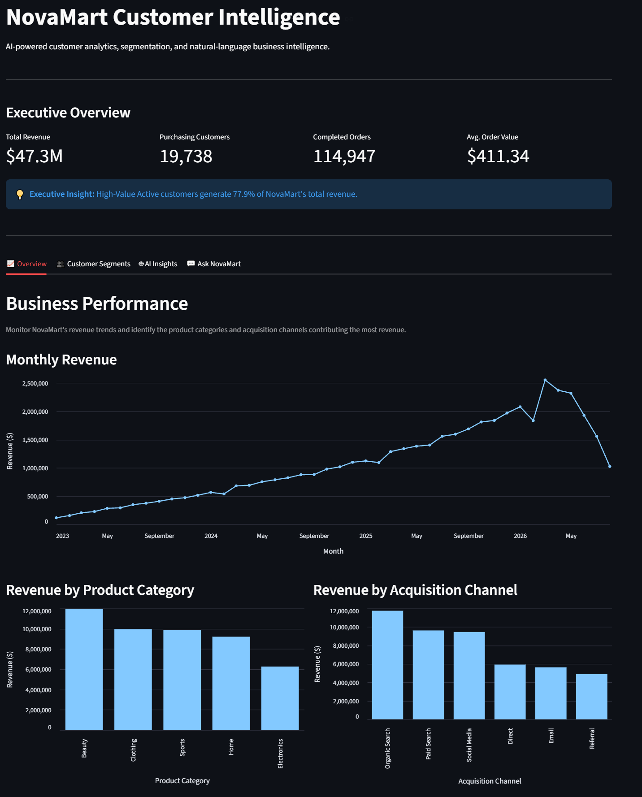
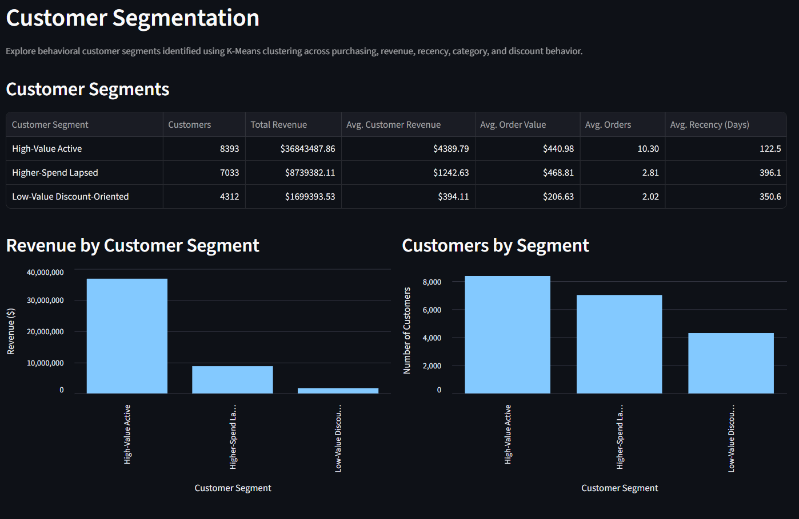
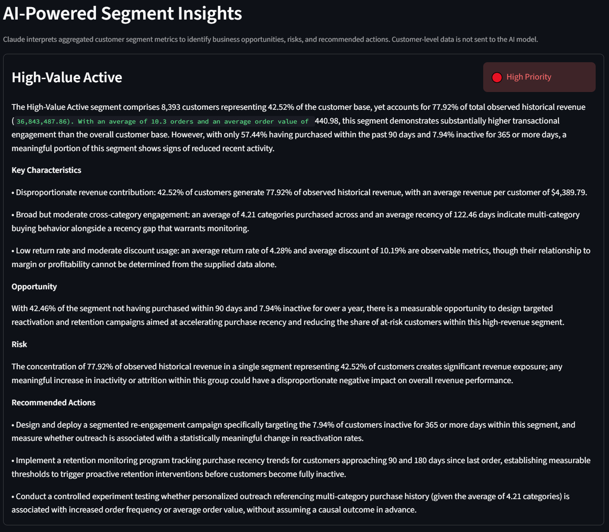
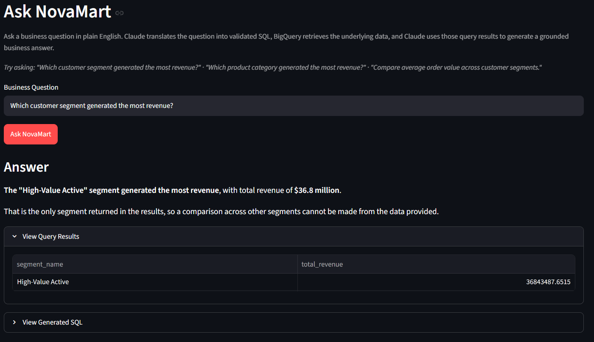
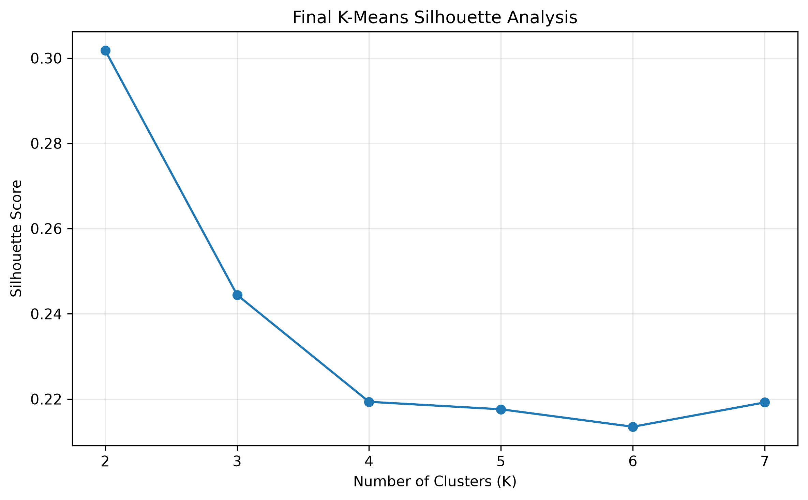
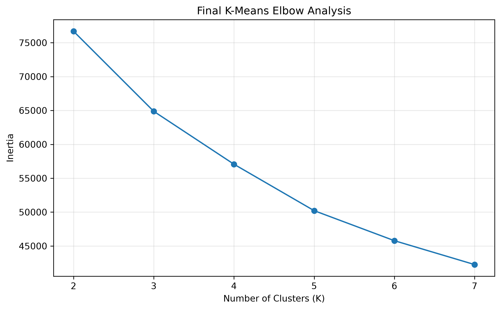

# NovaMart AI Customer Intelligence Platform

An end-to-end customer analytics platform combining **Google BigQuery, Python, machine learning, generative AI, and interactive business intelligence** to analyze e-commerce customer behavior.

NovaMart analyzes **20,000 customers, 125,000 transactions, and $47.3M in completed-order revenue**, using K-Means clustering to identify behavioral customer segments and the **Anthropic Claude API** to generate grounded business insights from aggregated analytics.

The platform also includes **Ask NovaMart**, a natural-language analytics interface that converts business questions into validated SQL, queries BigQuery, and generates answers grounded in the resulting data.

## Key Capabilities

- Cloud-based analytics using **Google BigQuery**
- Customer-level behavioral metric engineering using **SQL and Python**
- Customer segmentation using **K-Means clustering**
- AI-generated segment interpretation using the **Claude API**
- Natural-language-to-SQL business analytics
- SQL validation and BigQuery dry runs before query execution
- Interactive analytics dashboard built with **Streamlit and Altair**
- Transparent query results and generated SQL for AI-assisted answers

## Live Demo

🚀 **[Launch the NovaMart AI Customer Intelligence Dashboard](https://ai-customer-intelligence-yazuaftoreoqmmmmtlpukw.streamlit.app/)**

Explore customer segmentation, business performance, AI-generated segment insights, and the Ask NovaMart natural-language analytics interface.

## Project Results

The completed NovaMart platform demonstrates an end-to-end analytics workflow across cloud data engineering, machine learning, generative AI, and business intelligence.

Key results include:

- Analyzed **20,000 customers and 125,000 transactions**
- Processed approximately **$47.3 million in completed-order revenue**
- Engineered behavioral metrics for **19,738 purchasing customers**
- Identified **3 actionable customer segments** using K-Means clustering
- Found that **42.5% of purchasing customers generated approximately 77.9% of revenue**
- Identified a higher-spend lapsed segment where approximately **46.1% of customers had been inactive for at least 365 days**
- Built a BigQuery analytical warehouse with raw, engineered, segmentation, and AI insight tables
- Integrated Claude to generate structured business interpretations from aggregated segment metrics
- Built a natural-language analytics workflow that converts business questions into validated BigQuery SQL
- Developed an interactive Streamlit dashboard for KPI monitoring, segmentation analysis, AI insights, and natural-language querying

## Dashboard Preview









## Technology Stack

| Layer | Technologies |
|---|---|
| Cloud & Data Warehouse | Google Cloud Storage, Google BigQuery |
| Data Analysis | Python, Pandas, NumPy, SQL |
| Machine Learning | Scikit-learn, K-Means |
| Generative AI | Anthropic Claude API |
| Visualization | Streamlit, Altair |
| Development | Git, GitHub, VS Code |

## System Architecture

NovaMart follows a layered analytics architecture that separates data storage, deterministic analytics, machine learning, and generative AI.

### Analytics Pipeline

```text
Synthetic E-Commerce Data
          │
          ▼
Google Cloud Storage
          │
          ▼
Google BigQuery
          │
          ├──────────────► SQL Customer Metrics
          │
          ▼
Python Analytics Pipeline
          │
          ▼
K-Means Customer Segmentation
          │
          ▼
Aggregated Segment Profiles
          │
          ▼
Claude API
          │
          ▼
AI-Generated Segment Insights
          │
          ▼
Streamlit Dashboard
```

### Natural-Language Analytics Pipeline

Ask NovaMart provides a natural-language interface for querying the analytical warehouse.

```text
Business Question
       │
       ▼
Claude API
Natural Language → SQL
       │
       ▼
SQL Validation
       │
       ▼
BigQuery Dry Run
       │
       ▼
BigQuery Execution
       │
       ▼
Query Results
       │
       ▼
Claude API
Grounded Interpretation
       │
       ▼
Business Answer
```

Claude is used as an **interpretation and interface layer rather than the source of analytical truth**. Customer metrics, segmentation results, and query outputs are established through deterministic SQL and Python analytics.

For segment insights, Claude receives aggregated segment statistics rather than individual customer records. For natural-language analytics, generated SQL is validated and dry-run against BigQuery before execution, and the final response is grounded in the resulting query data.

## Dataset & Data Model

NovaMart uses a synthetic e-commerce dataset designed to simulate customer purchasing behavior across multiple years, product categories, acquisition channels, and transaction outcomes.

### Dataset Scale

| Dataset | Records | Description |
|---|---:|---|
| Customers | 20,000 | Customer demographics, signup information, acquisition channel, and device type |
| Products | 50 | Product catalog containing categories, subcategories, and prices |
| Transactions | 125,000 | Purchase activity including quantity, pricing, discounts, payment method, and order status |

Transaction activity spans **January 2023 through August 2026** and includes completed, returned, and cancelled orders.

### BigQuery Data Model

The analytical warehouse contains six primary tables:

| Table | Purpose |
|---|---|
| `customers` | Customer attributes and acquisition information |
| `products` | Product catalog and category information |
| `transactions` | Transaction-level e-commerce activity |
| `customer_metrics` | Engineered customer-level behavioral and revenue metrics |
| `customer_segments` | K-Means cluster assignments and business segment labels |
| `segment_ai_insights` | Structured Claude-generated insights for each customer segment |

The `transactions` table is **partitioned by transaction date** and **clustered by customer ID** to support efficient analytical queries.

### Customer Metrics

Completed transactions are aggregated into customer-level features including:

- Total orders
- Total revenue
- Average order value
- Recency
- Total items purchased
- Average discount
- Number of product categories purchased
- Return rate
- Customer tenure
- Annualized historical customer value

The project deliberately uses **annualized historical customer value** rather than labeling the metric as customer lifetime value (CLV), because the metric is based on observed historical purchasing behavior rather than a predictive lifetime-value model.

## Customer Segmentation Methodology

NovaMart uses **K-Means clustering** to identify groups of customers with similar purchasing behavior.

### Feature Engineering

The initial clustering analysis evaluated seven behavioral features:

- Total orders
- Total revenue
- Average order value
- Recency
- Category count
- Average discount
- Return rate

Highly skewed monetary, frequency, and recency variables were transformed using `log1p`, and the clustering features were standardized using `StandardScaler`.

During exploratory modeling, feature analysis showed that **return rate disproportionately influenced one cluster**. Return rate was therefore removed from the final cluster assignment while remaining available as a descriptive KPI for analyzing the resulting segments.

The final model uses six behavioral features:

1. Total orders
2. Total revenue
3. Average order value
4. Recency
5. Category count
6. Average discount

### Selecting the Number of Clusters

K-Means models were evaluated from **K=2 through K=7** using silhouette scores alongside business interpretability.

| K | Silhouette Score |
|---:|---:|
| 2 | 0.3018 |
| 3 | 0.2444 |
| 4 | 0.2193 |
| 5 | 0.2176 |
| 6 | 0.2135 |
| 7 | 0.2192 |

Although **K=2 produced the highest silhouette score**, the final model uses **K=3**.

The three-cluster solution separated the broad lower-engagement customer population into two commercially distinct groups: lower-value, discount-oriented customers and higher-spend customers with longer purchase recency. This provided greater business actionability for retention, reactivation, and customer strategy while maintaining reasonable cluster separation.





## Customer Segment Results

The final K-Means model identified three distinct customer segments based on purchasing behavior.

| Segment | Customers | Customer Share | Avg. Orders | Avg. Revenue | Avg. Order Value | Avg. Recency | Revenue Share |
|---|---:|---:|---:|---:|---:|---:|---:|
| High-Value Active | 8,393 | 42.52% | 10.30 | $4,389.79 | $440.98 | 122 days | 77.92% |
| Higher-Spend Lapsed | 7,033 | 35.63% | 2.81 | $1,242.63 | $468.81 | 396 days | 18.48% |
| Low-Value Discount-Oriented | 4,312 | 21.85% | 2.02 | $394.11 | $206.63 | 351 days | 3.59% |

### High-Value Active

This segment contains **42.5% of purchasing customers but generates approximately 77.9% of total revenue**.

Customers in this segment have the highest purchase frequency and average customer revenue, with relatively recent purchasing activity. Approximately **57.4% purchased within the previous 90 days**, while only **7.9% had been inactive for at least 365 days**.

### Higher-Spend Lapsed

This segment represents **35.6% of purchasing customers and 18.5% of revenue**.

Although these customers purchase less frequently than High-Value Active customers, they have the **highest average order value at $468.81**. Their average recency is approximately **396 days**, and roughly **46.1% had been inactive for at least 365 days**, making this group relevant for reactivation analysis.

### Low-Value Discount-Oriented

This segment contains **21.9% of purchasing customers but contributes only 3.6% of total revenue**.

These customers have the lowest average customer revenue and average order value of the three segments, while showing the highest average discount rate. Approximately **36.6% had been inactive for at least 365 days**.

### Key Business Finding

NovaMart's revenue is highly concentrated: the **High-Value Active segment generates approximately 77.9% of total revenue while representing 42.5% of purchasing customers**.

The segmentation also distinguishes two different lower-engagement populations: customers with relatively higher historical spend but long purchase recency, and customers characterized by lower spending and higher average discount usage. This distinction creates more targeted opportunities for customer retention and reactivation analysis.

## AI-Powered Segment Insights

NovaMart uses the **Anthropic Claude API** to translate aggregated customer segment metrics into concise business insights.

Claude does not receive raw customer-level records. Instead, the analytics pipeline first calculates segment-level statistics using BigQuery and Python. These aggregated metrics are then provided to Claude for interpretation.

For each segment, Claude generates structured JSON containing:

- Business summary
- Three key characteristics
- Business opportunity
- Business risk
- Three recommended actions
- Priority level

### Grounding and Validation

The AI insight pipeline includes several safeguards designed to keep generated insights grounded in the analytical data:

- Claude is instructed to use only the supplied segment metrics.
- Historical revenue is explicitly identified as observed revenue rather than predicted lifetime value.
- Segment characteristics are treated as descriptive rather than causal.
- Claude is instructed not to infer customer motivations, satisfaction, intent, profitability, or causes of churn.
- Demographics and preferences cannot be invented when they are not supplied.
- Recommendations may propose future actions, but the model cannot claim that those actions will produce specific outcomes.
- Responses must follow a predefined JSON structure.
- Python validates required fields, list lengths, and priority values before the insights are stored.

Validated insights are saved to BigQuery in the `segment_ai_insights` table and surfaced through the Streamlit dashboard.

## Ask NovaMart: Natural-Language Analytics

The platform also includes **Ask NovaMart**, a natural-language analytics interface that allows users to query the NovaMart warehouse without writing SQL manually.

The workflow is:

```text
Business Question
       ↓
Claude Generates SQL
       ↓
SQL Validation
       ↓
BigQuery Dry Run
       ↓
Query Execution
       ↓
BigQuery Results
       ↓
Claude Generates Grounded Answer
```

### SQL Safety Layer

Before generated SQL can execute, the application performs several checks:

- Queries must begin with `SELECT` or `WITH`.
- Data modification and definition operations such as `INSERT`, `UPDATE`, `DELETE`, `DROP`, `ALTER`, and `CREATE` are rejected.
- Multiple SQL statements are rejected.
- Referenced BigQuery tables must belong to an explicit allowlist.
- Queries are dry-run in BigQuery before execution.
- Transaction revenue uses a consistent defined calculation.
- Completed orders are used by default unless the question specifically concerns returns or cancellations.

The current validator is intentionally a **prototype safety layer rather than a production-grade SQL parser**. A production implementation could strengthen this architecture with AST-based SQL validation, query cost limits, authentication, authorization, and additional data-access controls.

### Grounded Business Answers

Claude receives the user's question together with the resulting BigQuery data rather than generating an answer directly from the question.

The answer-generation prompt instructs Claude to:

- Answer from the supplied query results only.
- Avoid inventing facts or unsupported causes.
- Avoid inferring customer motivations or intent.
- Distinguish descriptive comparisons from causal conclusions.
- Avoid recommendations unless the user requests them.
- State when the query results are insufficient to answer a question.

The Streamlit interface also exposes both the **underlying BigQuery results** and the **generated SQL**, allowing users to inspect the evidence supporting an AI-generated answer.

## Interactive Dashboard

NovaMart includes an interactive **Streamlit dashboard** that brings together BigQuery analytics, K-Means segmentation, and Claude-powered intelligence.

The dashboard contains four main views:

- **Overview:** Executive KPIs, monthly revenue trends, revenue by product category, and revenue by acquisition channel
- **Customer Segments:** Segment profiles, revenue contribution, customer distribution, purchase frequency, order value, and recency
- **AI Insights:** Claude-generated summaries, opportunities, risks, recommended actions, and priority levels based on aggregated segment metrics
- **Ask NovaMart:** Natural-language business questions with grounded answers, underlying BigQuery results, and generated SQL

Visualizations are built with **Altair** and include interactive tooltips for exploring underlying values.

The dashboard maintains a clear separation between analytical computation and AI interpretation: **BigQuery and Python establish the underlying metrics and segmentation results, while Claude interprets those results and provides the natural-language interface.**

## Repository Structure

```text
ai-customer-intelligence/
│
├── architecture/
│   ├── final_kmeans_elbow.png
│   └── final_kmeans_silhouette.png
│
├── dashboard/
│   └── app.py
│
├── data/
│   ├── raw/
│   │   ├── customers.csv
│   │   ├── products.csv
│   │   └── transactions_v3.csv
│   │
│   └── processed/
│       ├── customer_metrics.csv
│       ├── clustering_features.csv
│       ├── final_customer_segments.csv
│       ├── final_kmeans_evaluation.csv
│       ├── final_segment_profiles.csv
│       └── segment_ai_insights.json
│
├── sql/
│   └── customer_metrics.sql
│
├── src/
│   ├── customer_metrics.py
│   ├── data_generator.py
│   ├── data_validation.py
│   ├── eda_v3.py
│   ├── final_kmeans_evaluation.py
│   ├── final_segmentation.py
│   ├── kmeans_feature_comparison.py
│   ├── natural_language_analytics.py
│   ├── prepare_clustering.py
│   ├── product_generator.py
│   ├── segment_ai_insights.py
│   ├── transaction_generator_v3.py
│   ├── upload_ai_insights_bigquery.py
│   └── upload_segments_bigquery.py
│
├── .gitignore
├── README.md
└── requirements.txt
```

The repository separates the project into:

- **`data/`** — synthetic source data and processed analytical outputs
- **`src/`** — data generation, analytics, machine learning, AI, and BigQuery integration
- **`sql/`** — BigQuery analytical SQL
- **`dashboard/`** — Streamlit application
- **`architecture/`** — model evaluation visualizations

## Installation & Setup

### 1. Clone the Repository

```bash
git clone <repository-url>
cd ai-customer-intelligence
```

### 2. Create a Virtual Environment

```bash
python -m venv .venv
```

Activate the environment.

**Windows PowerShell:**

```powershell
.venv\Scripts\Activate.ps1
```

**macOS / Linux:**

```bash
source .venv/bin/activate
```

### 3. Install Dependencies

```bash
pip install -r requirements.txt
```

### 4. Configure the Anthropic API Key

Create a `.env` file in the project root:

```text
ANTHROPIC_API_KEY=your_api_key_here
```

The `.env` file is excluded from version control through `.gitignore`. Never commit API keys or other credentials to the repository.

### 5. Configure Google Cloud

The project uses the Google Cloud project:

```text
novamart-customer-intelligence
```

Authenticate Application Default Credentials using the Google Cloud CLI:

```bash
gcloud auth application-default login
```

The BigQuery dataset used by the application is:

```text
novamart_analytics
```

The application expects the following BigQuery tables:

```text
customers
products
transactions
customer_metrics
customer_segments
segment_ai_insights
```

### 6. Run the Dashboard

From the project root:

```bash
streamlit run dashboard/app.py
```

Streamlit will start the NovaMart Customer Intelligence dashboard locally.

## Environment Variables

| Variable | Purpose |
|---|---|
| `ANTHROPIC_API_KEY` | Authenticates requests to the Anthropic Claude API |

API credentials are not included in this repository.

## Skills Demonstrated

- **Data Analytics:** Customer behavior analysis, KPI development, revenue analysis, exploratory data analysis, and translating analytical findings into business insights
- **SQL & Cloud Analytics:** BigQuery, analytical SQL, aggregations, joins, partitioned and clustered tables, query validation, and dry runs
- **Machine Learning:** Feature engineering, transformation, standardization, K-Means clustering, silhouette analysis, and business-oriented model selection
- **Generative AI:** Claude API integration, structured outputs, prompt grounding, natural-language-to-SQL, and validation guardrails
- **Business Intelligence:** Streamlit and Altair dashboards for KPI monitoring, customer segmentation, and interactive analytics

## Limitations & Future Improvements

NovaMart is designed as a portfolio-scale analytics platform rather than a production deployment.

### Current Limitations

- **Synthetic data:** The dataset is programmatically generated and does not represent real customer behavior.
- **Descriptive segmentation:** K-Means identifies behavioral similarities but does not predict future behavior or establish causal relationships.
- **Historical customer value:** The platform calculates annualized historical customer value rather than predictive customer lifetime value (CLV).
- **Prototype SQL validation:** Ask NovaMart uses table allowlists, keyword restrictions, single-statement checks, and BigQuery dry runs rather than a production-grade SQL parser.
- **Cloud setup:** BigQuery resources must currently be configured separately rather than through an automated deployment pipeline.
- **LLM variability:** Claude-generated interpretations may vary between requests even when grounded in the same analytical data.

### Future Improvements

- Develop predictive **customer lifetime value and churn models**
- Implement AST-based SQL parsing, query-cost controls, and stronger access controls
- Add automated data-quality, model-quality, and regression tests
- Build scheduled pipelines for incremental transaction processing and segment-drift monitoring
- Containerize and deploy the Streamlit application to a cloud environment

## Author

**Arib Khan**

B.S. Business Analytics — Oregon State University  
Focus: Data Analytics, Business Intelligence, Machine Learning, and AI-enabled analytics
